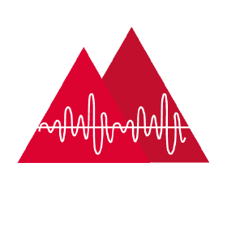
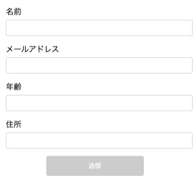
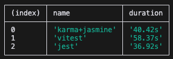
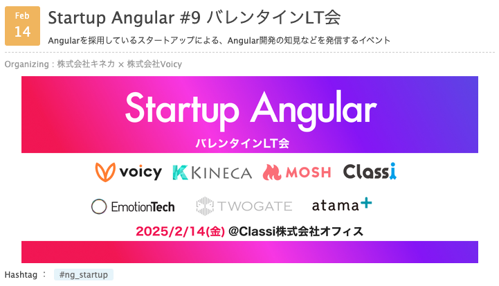

#  Angular  +  Vitest でのコンポーネントテスト<br>ことはじめ

## だいち / da1chi24

---
<!--
header: Angular +  Vitest でのコンポーネントテストことはじめ | da1chi24
-->

#  Angular とテストフレームワーク

## Angular では **karma / jasmine** がデフォルト

しかし 2023年 から karma が**非推奨**になった

> Karma is deprecated and is not accepting new features or general bug fixes.

後継のテストランナーが決まってから1年はメンテするため、すぐ移行の必要ないとのこと

> Critical security issues in Karma will still be triaged and fixed as necessary. This will continue until 12 months after Angular CLI's Web Test Runner support is marked stable.

ref. https://github.com/karma-runner/karma

---

# 次のテストランナーの移行先

## Web Test Runner, Jest, Vitest が俎上に上がっている

> ### Replace Karma 
> We’ve been exploring Web Test Runner, Jest, and Vitest and as part of this project will evaluate each of these runners and integrate it with the CLI.

ref. [Angular 2025 Strategy](https://blog.angular.dev/angular-2025-strategy-9ca333dfc334)

---

##  jest

- 2024年で人気1位 
- Angular では 3rd party の `jest-preset-angular` プラグインにより組み込みが容易
- 公式で `@angular-devkit/build-angular:jest` が提供されている

##  Vitest

- 人気急上昇中のテストフレームワーク
- ブラウザテスト、スナップショットテスト、カバレッジなど機能が充実
- 公式のサポートはまだない

---

##  Vitest のポイント

- ESM 標準サポート
- HMR (Hot Module Replacement)
  - ソースコードの変更を検出し、関連するテストだけを即座に実行
- **テストの実行が高速**

👉👉 パフォーマンス上のメリットの話が多い

---

# 推測するな、計測せよ

---

##  Angular アプリに  Vitest を導入

 `analogjs` のプラグイン `@analogjs/vite-plugin-angular` を利用する。

詳しい導入方法はドキュメントを参照ください。
手順通りにやればテストが動くところまでいくはず。

ref. [Using Vitest with An Angular Project \| Analog](https://analogjs.org/docs/features/testing/vitest#setup-for-running-tests-for-node)

---

## 検証用の入力フォームの</br>コンポーネントを用意



---

# 用意したテストケース

1. 各inputに値を入力
2. Submitボタンをクリック
3. onSubmitが実行され、入力された値が引数として渡される

---

# テストケースを500回実行する

```ts
const TEST_COUNT = 500
const array = Array.from({ length: TEST_COUNT }, (_, i) => ({ index: i + 1 }));

describe('FormComponent', () => {
  array.forEach((_, i) => {
    it(`フォームを入力して内容を送信する part ${i}`, async () => {
      const formSubmit = vi.fn();
      const { getByLabelText, getByRole } = await render(FormComponent, {
        on: { formSubmit }
      });

      fireEvent.input(getByLabelText('名前'), { target: { value: `test${i}` } });
      // ...
      fireEvent.click(getByRole('button'));

      expect(formSubmit).toHaveBeenCalledWith({
        name: `test${i}`,
        // ...
      })
    });
  });
});
```

---

# ベンチマークの実装

```ts
import { exec } from "node:child_process";
import { performance } from "node:perf_hooks";
import { promisify } from "node:util";

const execAsync = promisify(exec);
const runScript = async (script: string, label: string) => {
  const start = performance.now();
  await execAsync(script);
  // ...
  const end = performance.now();
  const duration = (end - start) / 1000;
  return { name: label, duration: `${duration.toFixed(2)}s` };
};

const main = async () => {
  const scripts = [
    { script: "pnpm run test:vitest --watch=false", label: "vitest" },
    // ...
  ];
  const results = await Promise.all(
    scripts.map(({ script, label }) => runScript(script, label)),
  );
  console.table(results);
};
main();
```

---

# 計測したライブラリ

## karma / jasmine (headless chrome)
## Vitest (browser mode) / WebdriverIO (headless chrome)
## jest (not browser test)

---

## ベンチマークの実行結果

### ※ サンプリングの回数や実行環境にも左右されるので参考までに



---

## ベンチマークを実施して思ったこと

- 📝 カジュアルに実行しただけでは vitest が早い実感が得られなかった
- 📝 セットアップが遅いのか、テストの実行が遅いのかまでの特定はできていない


検証で使ったコード  ref. [kudoas/benchmark\-component\-test\-for\-angular](https://github.com/kudoas/benchmark-component-test-for-angular)

---

# 最後に宣伝❗️



https://voicy.connpass.com/event/342447/
